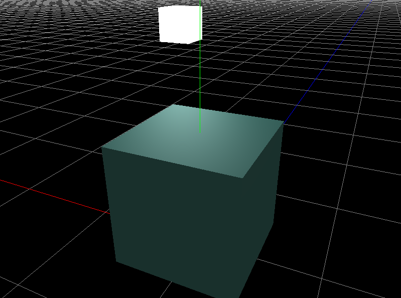

## Nene Engine

#### 我们的游戏引擎　(•̀ᴗ•́)و

- 跨平台渲染 API 抽象层
- 支持 Direct 3D 11 和 OpenGL 4.2+
- 通过面向对象的方法高效创建三维场景

_ _ _

**仅需要20行的代码就能构建一个简单的三维场景！**

简单例子：



对应代码：

```cpp
int main() {
	// 初始化
	Utils::init("Sample1", 800, 600);
	// 背景色
	Utils::clearColor(0.1f, 0.1f, 0.1f);
	// 着色器
#ifdef NENE_DX
	auto pShader = Shader::create("Resources/Shaders/HLSL/Texture.hlsl", "Resources/Shaders/HLSL/Texture.hlsl", POSITION_NORMAL_TEXTURE);
#elif NENE_GL
	auto pShader = Shader::create("Resources/Shaders/GLSL/Texture.vert", "Resources/Shaders/GLSL/Texture.frag", POSITION_NORMAL_TEXTURE);
#endif
	// 摄像机控制
	CameraController cc;
	// 可绘制对象
	auto pShape = Geometry::createCube();
	// 主循环
	while (!Utils::windowShouldClose()) {
		// 处理 IO
		Utils::pollEvents();
		// 更新摄像机
		cc.update();
		// 清空颜色和深度缓冲
		Utils::clear();
		// 绘制
		pShape->draw(pShader, cc.getCamera());
		// 交换缓冲
		Utils::swapBuffers();
	}
	// 释放资源
	Utils::terminate();
	//
	return 0;
}

```

